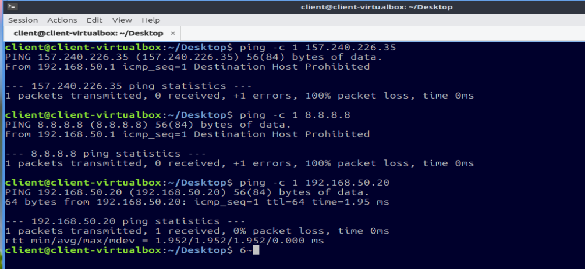
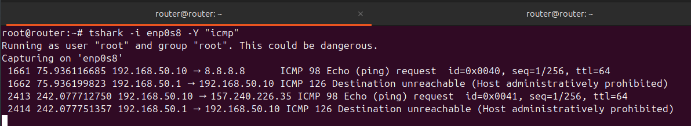
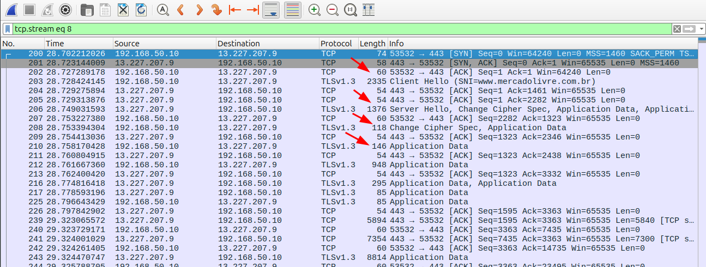
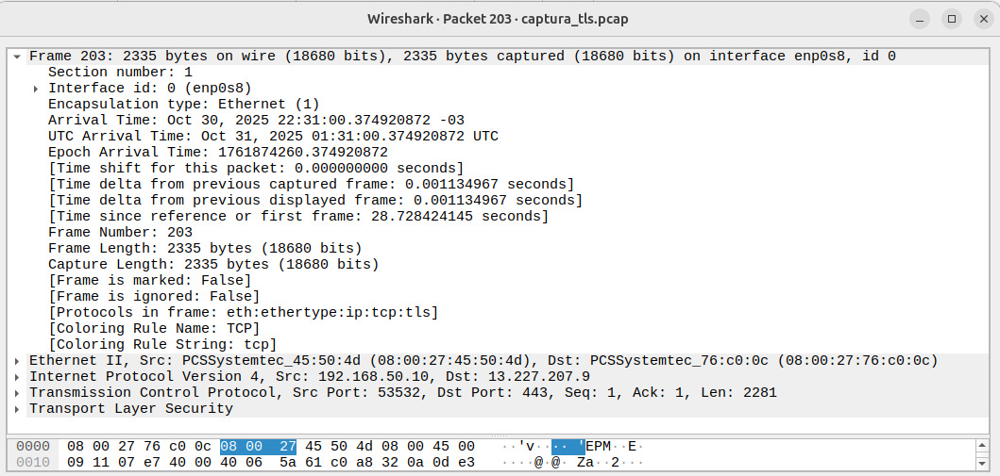

# Introdução

O presente trabalho tem como objetivo apresentar a implementação de um firewall utilizando o `iptables` em um ambiente
Linux. O firewall será configurado para controlar o tráfego de rede, permitindo ou bloqueando conexões com base em
regras específicas.

No ambiente experimental, utilizaremos três máquinas virtuais: uma atuando como roteador/firewall, outra como cliente
interno e a terceira como servidor interno. Em seguida, detalharemos as regras implementadas no firewall, a metodologia
utilizada para testar sua eficácia e a análise dos resultados obtidos. Detalhes dos _scripts_ podem ser consultados no
repositório do GitHub: https://github.com/nori-marcos/Firewall

# Fundamentação Téorica

Um firewall é um sistema de segurança de rede que monitora e controla o tráfego de entrada e saída com base em regras de
segurança predefinidas [@kurose_ross_2009]. Ele atua como uma barreira entre redes confiáveis e não confiáveis,
protegendo os sistemas internos contra acessos não autorizados e ameaças externas [@kurose_ross_2009].

No Linux, o `iptables` é uma ferramenta amplamente utilizada para configurar firewalls [@linuxconfig_iptables_basic].
Ele permite a criação de regras que definem como o tráfego deve ser tratado, seja permitindo, bloqueando ou
redirecionando pacotes de dados.

# Ambiente Experimental

Como mencionado anteriormente, o ambiente experimental consiste em três máquinas virtuais: Roteador/Firewall, Cliente
Interno e Servidor Interno. A máquina Roteador/Firewall está configurada para atuar como o ponto central de controle do
tráfego de rede entre o Cliente Interno e o Servidor Interno. Além disso, todos foram configurados com endereços IP
estáticos para garantir a comunicação adequada entre eles.

# Roteador/Firewall

Os scripts de configuração do firewall estão contidos em três arquivos principais: `00_enable_routing.sh`,
`01_setup_firewall.sh` e `02_cleanup_firewall.sh`. A máquina virtual é um Debian sem interface gráfica, configurada com
dois adaptadores de rede: um em modo "Rede Interna" (conectado ao Cliente e Servidor Internos) e outro em modo "NAT" (
conectado à Internet). Os detalhes de configuração do firewall são apresentados nas próximas subseções.

## Roteamento e NAT

O _script_ `00_enable_routing.sh` ativa o encaminhamento de pacotes IP no sistema. Três variáveis principais são
definidas: `WAN_IF` (interface de rede conectada à Internet), `LAN_IF` (interface de rede conectada à rede interna) e
`LAN_IP` (endereço IP da interface LAN). A seguir, o_script_configura o endereço IP da interface LAN, ativa o
encaminhamento de pacotes e configura o NAT (Network Address Translation) para permitir que os dispositivos na rede
interna acessem a Internet através do roteador/firewall.

```bash
#!/bin/bash
# Habilita roteamento e NAT de forma persistente.

# Interface de saída para a internet, conectada ao provedor
WAN_IF="${WAN_IF:-enp0s3}"
# Interface de rede interna, utilizada pelos clientes para se conectar ao roteador
LAN_IF="${LAN_IF:-enp0s8}"
# Endereço IP da rede interna (LAN)
LAN_IP="${LAN_IP:-192.168.50.1/24}"

echo "[+] Ativando roteamento IPv4..."
sysctl -w net.ipv4.ip_forward=1
sed -i 's/^#\?net.ipv4.ip_forward.*/net.ipv4.ip_forward=1/' /etc/sysctl.conf

echo "[+] Configurando IP da LAN..."
ip addr add $LAN_IP dev $LAN_IF
ip link set $LAN_IF up

echo "[+] Limpando regras antigas..."
iptables -t nat -F

echo "[+] Ativando NAT (masquerade) na interface $WAN_IF..."
iptables -t nat -A POSTROUTING -o $WAN_IF -j MASQUERADE

echo "[✓] Roteamento e NAT configurados."
```

## Regras do Firewall

O_script_`01_setup_firewall.sh` é responsável por configurar as regras do firewall utilizando o `iptables`. As cadeias
de entrada (INPUT), encaminhamento (FORWARD) e saída (OUTPUT) são configuradas com políticas padrão seguras, bloqueando
todo o tráfego por padrão. Em seguida, regras específicas são adicionadas para permitir o tráfego necessário e bloquear
conexões indesejadas:

**INPUT**: Permite o tráfego de loopback, conexões estabelecidas e acesso ao servidor web na porta 8000. No entanto, o
tráfego ICMP (ping) é permitido apenas para a rede interna.

```bash
echo "[+] INPUT: Permitir tráfego de loopback"
iptables -A INPUT -i lo -j ACCEPT

echo "[+] INPUT: Permitir conexões estabelecidas"
iptables -A INPUT -m conntrack --ctstate ESTABLISHED,RELATED -j ACCEPT

echo "[+] INPUT: Permitir acesso ao servidor web (porta 8000)"
iptables -A INPUT -s $REDE_INTERNA -p tcp --dport 8000 -m state --state NEW -j ACCEPT

echo "[+] INPUT: Permitir Ping (ICMP) da rede interna"
iptables -A INPUT -s $REDE_INTERNA -p icmp --icmp-type echo-request -j ACCEPT
```

**FORWARD**: Permite conexões estabelecidas, bloqueia DNS para redes sociais específicas (Facebook e TikTok)
utilizando correspondência de strings, permite DNS de saída (UDP e TCP), permite HTTP e HTTPS de saída, e gerencia o
tráfego ICMP (ping) de forma controlada. No nosso cenário, a resolução de DNS foram bloqueadas para o Facebook e TikTok,
enquanto o tráfego ICMP foi permitido apenas para o Servidor Interno.

```bash
echo "[+] FORWARD: Permitir conexões estabelecidas"
iptables -A FORWARD -m conntrack --ctstate ESTABLISHED,RELATED -j ACCEPT

echo "[+] FORWARD: Bloqueando DNS para redes sociais (String Match)"
iptables -A FORWARD -s $REDE_INTERNA -p udp --dport 53 -m string --string "facebook" --algo bm -j REJECT
iptables -A FORWARD -s $REDE_INTERNA -p udp --dport 53 -m string --string "tiktok" --algo bm -j REJECT

echo "[+] FORWARD: Permitir DNS (UDP e TCP) de saída (Geral)"
iptables -A FORWARD -s $REDE_INTERNA -p udp --dport 53 -m state --state NEW -j ACCEPT
iptables -A FORWARD -s $REDE_INTERNA -p tcp --dport 53 -m state --state NEW -j ACCEPT

echo "[+] FORWARD: Permitir HTTP e HTTPS de saída"
iptables -A FORWARD -s $REDE_INTERNA -p tcp --dport 80 -m state --state NEW -j ACCEPT
iptables -A FORWARD -s $REDE_INTERNA -p tcp --dport 443 -m state --state NEW -j ACCEPT

echo "[+] FORWARD: ICMP (Ping) gerenciado"
iptables -A FORWARD -s $REDE_INTERNA -d $SERVIDOR_INTERNO -p icmp --icmp-type echo-request -j ACCEPT
iptables -A FORWARD -s $REDE_INTERNA -p icmp --icmp-type echo-request -j REJECT --reject-with icmp-host-prohibited
```

**OUTPUT**: Aceita todo o tráfego de saída sem restrições. Essa escolha visa garantir que o firewall não interfira nas
conexões iniciadas pela própria máquina roteadora/firewall, permitindo que ela se comunique livremente com outros
dispositivos na rede ou na Internet.

# Cliente Interno

O Cliente Interno é configurado com um endereço IP estático na rede interna e utiliza o roteador/firewall como seu
gateway padrão. Isso permite que o Cliente Interno envie tráfego para a Internet através do firewall. No nosso cenário,
o Cliente Interno está configurado com o endereço IP `192.168.50.10`. Na seção de "Análise de Resultados", detalharemos
os testes realizados para verificar a eficácia das regras do firewall.

# Servidor Interno

O Servidor Interno também é configurado com um endereço IP estático na rede interna e utiliza o roteador/firewall como
seu gateway padrão. O Servidor Interno está configurado com o endereço IP `192.168.50.20`. Ele hospeda um servidor web
simples na porta 8000, que pode ser acessado pelo Cliente Interno. Na seção de "Análise de Resultados", apresentaremos
os testes realizados para verificar o acesso ao servidor web através do firewall.

# Análise de Resultados

A implementação do firewall utilizando `iptables` demonstrou ser eficaz na proteção da rede interna contra acessos não
autorizados e na filtragem de tráfego indesejado. As regras configuradas permitiram controlar o acesso a serviços
específicos, como o servidor web, e bloquearam tentativas de acesso a redes sociais por consultas DNS.

## Permissão de HTTP/HTTPS

Para testar a permissão de tráfego HTTP e HTTPS, utilizamos o navegador web no Cliente Interno para acessar páginas webs
externas. Na Figura 1, quando as regras de firewall estavam ativadas, o Cliente Interno conseguiu resolver o domínio do
Mercado Livre e acessar a página web normalmente, confirmando que o tráfego HTTP/HTTPS foi permitido conforme esperado:


## Bloqueio ICMP Externo e Liberação ICMP Interno

Para testar o bloqueio de pacotes ICMP (ping) provenientes da Internet, utilizamos a ferramenta `ping` a partir de uma
máquina externa para o endereço IP público do roteador/firewall. Com as regras de firewall ativas, os pacotes ICMP foram
bloqueados conforme esperado, e o roteador/firewall não respondeu aos pings, confirmando a eficácia da regra de bloqueio
de ICMP.

Na Figura 2, o primeiro `ping` é realizado para o IP `157.240.226.35` do Facebook e como esperado, a resposta
_Destination Host Prohibited_ é recebida, indicando que os pacotes ICMP foram bloqueados pelo firewall. O mesmo acontece
para o segundo `ping` ao IP `8.8.8.8` do Google DNS. No entanto, o terceiro `ping` ao IP `192.168.50.20`, que é o
Servidor Interno, recebe respostas normalmente, confirmando que o tráfego ICMP dentro da rede interna está permitido.



## Bloqueio de DNS para Redes Sociais

Para testar o bloqueio de consultas DNS para redes sociais, realizamos testes de resolução de nomes de domínio a partir
do Cliente Interno. Na Figura 3, com as regras de firewall desativadas, o Cliente Interno conseguiu resolver o domínio
do Facebook e do Mercado Livre normalmente, confirmando que o DNS estava funcionando corretamente:


Já na Figura 4, com as regras de firewall ativas, o Cliente Interno não conseguiu resolver o domínio do Facebook, como
esperado, enquanto o domínio do Mercado Livre foi resolvido normalmente, confirmando a eficácia da regra de bloqueio de
DNS para redes sociais:


## Análise de Tráfego no Gateway

Para analisar o tráfego de rede passando pelo roteador/firewall, utilizamos a ferramenta `tshark`. Na Figura 5, podemos
observar que o `ICMP` destinado a destinos externos está sendo bloqueado, conforme as regras configuradas no firewall:



## Captura e Análise do Tráfego TLS

Uma vez que a máquina Roteador/Firewall utiliza uma distribuição Linux sem interface gráfica, foi gerado um arquivo de
captura de pacotes no formato `.pcap`. O arquivo foi disponibilizado no servidor Python na porta 8000, permitindo que
fosse baixado e analisado em uma máquina com interface gráfica utilizando o Wireshark.

Na análise do tráfego TLS, a Figura 7 mostra os quadros mais importantes capturados durante a navegação do Cliente como
o "Client Hello" e o "Server Hello", que são partes essenciais do processo de estabelecimento de uma conexão TLS segura.
Em seguida, podemos observar o "Application Data", que representa os dados criptografados trocados entre o Cliente e o
Servidor após a negociação do TLS.



No quadro "Client Hello" da Figura 8, podemos ver que a origem do tráfego é o IP do Cliente Interno (`192.168.50.10`) e
o destino é o site do Mercado Livre (`13.227.207.9`) na porta 443, que é a porta padrão para conexões HTTPS. Isso
confirma que o Cliente está tentando estabelecer uma conexão segura com o servidor web do Mercado Livre.



# Desafios Enfrentados

Durante a implementação do firewall, enfrentamos alguns desafios, como a configuração correta das regras de
encaminhamento. Em uma primeira tentativa, havia sido configurado um `ipset`, bloqueando o acesso a determinados IPs. No
entanto, no caso de redes sociais, os IPs são dinâmicos e frequentemente alterados, o que tornava essa abordagem
ineficaz. Neste caso, o Cliente Interno continuava conseguindo acessar as redes sociais mesmo com os IPs bloqueados.
Para resolver esse problema, optamos por utilizar a correspondência de strings nas consultas DNS, o que se mostrou uma
solução mais robusta e eficaz para bloquear o acesso a essas redes.

Além disso, garantir que as regras do firewall fossem aplicadas corretamente e testadas de forma abrangente exigiu
atenção aos detalhes e uma compreensão profunda do funcionamento do `iptables`. As regras precisaram ser reescritas e
reordenadas várias vezes para garantir que o comportamento desejado fosse alcançado sem comprometer a funcionalidade.

# Conclusão

A implementação do firewall utilizando `iptables` em um ambiente Linux demonstrou ser uma solução eficaz para proteger a
rede interna contra acessos não autorizados e controlar o tráfego de rede. As regras configuradas permitiram filtrar
conexões indesejadas, como o bloqueio de DNS para redes sociais e o controle de pacotes ICMP, enquanto ainda permitiam o
acesso a serviços essenciais, como HTTP/HTTPS e o servidor web interno.

# Referências
